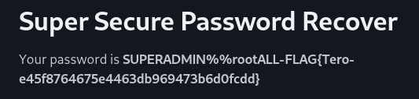
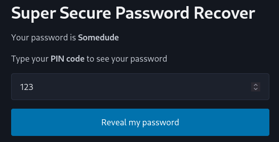
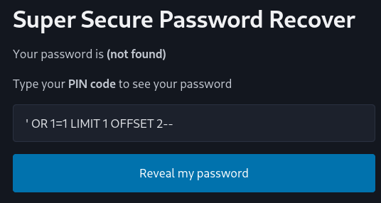
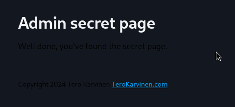
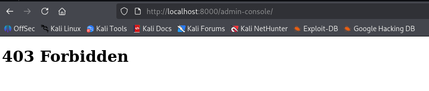
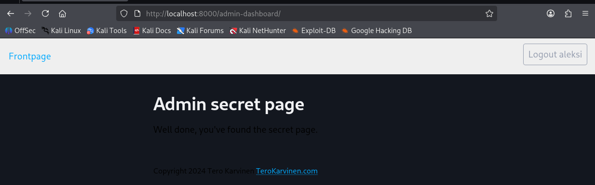

# h2 Break & Unbreak

**Päivämäärä:** 31.8.2026  
**Tekijä:** Aleksi Pamilo   
**Ympäristö:** Kali Linux 2026.2 (x86_64, UTM/QEMU macOS), Python 3.13, Firefox.

---

### 1. Teoria
- **OWASP Top 10: A01 Broken Access Control**
    - `Broken Access Control` nousi OWASP Top 10 -listan sijalle 1. Se on kaikkein yleisin sovelluksista löydetty haavoittuvuus ja sitä esiintyi jopa 94 prosentissa testatuista sovelluksista.
    - **Oikeuksien ohittaminen:** Hyökkääjä muokkaa URL-osoitteen parametreja, HTML-sivua, pyyntöjen otsikoita tai evästeitä, ja pääsee ohittamaan kirjautumisen.
    - **API-rajapintojen puutteet:** API-pyynnöiltä puuttuvat tarkistukset, vaikka käyttöliittymästä painikkeet olisikin piilotettu.
    - **Haavoittuvuuden torjuminen:**
        - Palvelinpuolen tulee varmistaa käyttäjän oikeudet, pääsynhallintaa ei voi jättää selaimen tai käyttöliittymän varaan.
        - Palvelimen on aina varmistettava, että kirjautuneella käyttäjällä on oikeus käsitellä juuri pyynnössä annettua ID-tietuetta, eikä luottaa sokeasti suoraan parametriin.
- **Karvinen: Fuzz URLs with ffuf**
    - `ffuf` on erittäin nopea ja monipuolinen verkkosovellusten hakemistomurtotyökalu. Sitä käytetään osoitteiden, parametrien ja otsikoiden automaattiseen kokeiluun.
    - Työkalulle annetaan sanalista (`-w`, esim. `SecLists common.txt`), kohdeosoitteeseen merkitään paikkamerkki `FUZZ` (esim. `http://osoite/FUZZ`), jonka tilalle `ffuf` kokeilee automaattisesti jokaista sanalistan riviä.
    - `-fs`-parametrilla voidaan suodattaa vastaukset tavukoon perusteella, `-fl` rivimäärän, `-fw` sanamäärän ja `-fc` HTTP-tilakoodien perusteella.
- **Karvinen: Raportin kirjoittaminen**
    - Raportti kirjoitetaan aina reaaliaikaisesti tekemisen aikana ja menneessä aikamuodossa, kertoen täsmällisesti annetut komennot, kellonajat ja testatut lopputulokset.
    - Kokeiden ja käytetyn testiympäristön dokumentoinnin on oltava niin tarkkaa, että toinen henkilö saa täysin samat tulokset raportin ohjeilla.
    - Kaikki käytetyt lähteet merkitään huolellisesti, ja raportti kuvaa vain oikeasti tehtyjä kokeita ilman sepittämistä.
- **PortSwigger 2020: What is SQL injection? - Web Security Academy**
    - SQL-injektio on haavoittuvuus, joka mahdollistaa sovelluksen tietokantakyselyjen manipuloinnin, jolloin hyökkääjä voi lukea luvattomia tietoja, muokata tai tuhota dataa.
    - Hyökkääjä voi manipuloida kyselyn logiikkaa (esim. `' OR 1=1--`), ohittaa kirjautumisen (`administrator'--`) tai hakea muiden taulujen tietoja `UNION`-kyselyillä.
    - Ennaltaehkäistään käyttämällä aina parametrisoituja kyselyitä, jolloin käyttäjän syötettä ei koskaan liitetä suoraan osaksi SQL-komentoa.

---

### 2. 010-staff-only - Murtautuminen ja korjaus
- **Murtautuminen:**
    - Käynnistin sovelluksen
        ```bash
        cd challenges/010-staff-only/
        python3 staff-only.py
        ```
    - Avasin osoitteen [http://localhost:5000](http://localhost:5000) Firefox -selaimella.
    - Sivusto sisälsi PIN-koodi kentän. Koodi `123` palautti salasanan `Somedude`.
    - Avasin developer tools `F12` napilla, ja vaihdoin numerokentän tekstikentäksi `type="number"` -> `type="text"`, tämän jälkeen pystyin syöttämään kenttään tekstiä.
    - **Testatut syötteet:**
        - `' OR 1=1--` palautti vain ensimmäisen rivin, eli tavallisen käyttäjän salasanan `foo`.
        - `' OR 1=1 LIMIT 1 OFFSET 1` ohitti ensimmäisen rivin ja palautti salasanan `Somedude`.
        - `' OR 1=1 LIMIT 1 OFFSET 2` ohitti toisen rivin ja palautti ylläpitäjän salasanan `SUPERADMIN%%rootALL-FLAG{Tero-e45f8764675e4463db969473b6d0fcdd}`.
        - `' UNION SELECT group_concat(password) FROM pins--` tulosti kaikki salasanat tietokannasta pilkulla erotettuna.
        
        

- **Korjaaminen:**
    - Sovelluksen koodissa syötemuuttuja yhdistettiin suoraan SQL-kyselyyn:
        ```python
        sql = "SELECT password FROM pins WHERE pin='"+pin+"';"
        res=db.session.execute(text(sql))
        ```
    - Korjattu koodi:
        ```python
        sql = "SELECT password FROM pins WHERE pin = :pin"
        res=db.session.execute(text(sql), { "pin": pin })
        ```
        - Testi 1: Syötettiin oikea PIN-koodi `123` -> sovellus palautti salasanan `Somedude`.
        - Testi 2: Aiemmin toiminut SQL-injektio `' OR 1=1 LIMIT 1 OFFSET 2--` -> sovellus tulosti: Your password is (not found)

        
        

- **Pohdinta:**
    - **Haavoittuvuuden yleisyys:** SQL-injektio on edelleen yleinen virhe sovelluksissa, joissa kyselyitä rakennetaan manuaalisesti ilman ORM-kehyksiä tai parametrisointia.
    - **Muut huomiot / Sovelluslogiikka:** Vaikka SQL-injektio korjattiin, harjoitusympäristön sovelluslogiikassa on kaksi merkittävää arkkitehtuuritason riskiä:
        1. Salasanat tallennetaan tietokantaan selväkielisinä ilman tiivistystä ja suolausta.
        2. 3-numeroinen PIN-koodi mahdollistaa kenen tahansa salasanan urkkimisen sekunneissa automaattisella kokeilulla, sillä sovelluksesta puuttuu pyyntöjen rajoitus ja varsinainen pääsynhallinta.
    
---

### 3. 020-your-eyes-only - Murtautuminen ja korjaus
- **Ympäristö ja valmistelu:**
    Luotiin virtuaaliympäristö, asennettiin riippuvuudet ja alustettiin Django-tietokanta:
    ```bash
    cd challenges/020-your-eyes-only/
    sudo apt-get -y install virtualenv
    virtualenv virtualenv/ -p python3 --system-site-packages
    source virtualenv/bin/activate
    pip install -r requirements.txt
    cd logtin/
    ./manage.py makemigrations; ./manage.py migrate
    ./manage.py runserver
    ```
    - Avasin osoitteen [http://localhost:8000](http://localhost:8000) Firefox -selaimella.
- **Murtautuminen:**
    - **Piilotettujen polkujen etsiminen**: Asennettiin SecLists `sudo apt update && sudo apt install seclists -y` ja suoritettiin `ffuf`-haku:
        ```bash
        ffuf -w /usr/share/seclists/Discovery/Web-Content/common.txt -u http://localhost:8000/FUZZ
        ```
    - Työkalu löysi yhden polun: `admin-console`, joka ohjasi kirjautumattoman käyttäjän kirjautumissivulle.
    - Rekisteröin uuden tavallisen käyttäjän ja navigoin kirjautuneena suoraan osoitteeseen [http://localhost:8000/admin-console/](http://localhost:8000/admin-console/).
    - Pääsy salaiselle sivulle onnistui ilman ylläpito-oikeuksia. Sovellus tarkisti vain kirjautumisen, mutta ei varsinaista käyttäjäroolia.
    
    
- **Korjaaminen**:
    ```bash
    cd logtin/hats
    nano views.py
    ```
    ```python
    # Haavoittuva:
    class AdminShowAllView(UserPassesTestMixin, TemplateView):
        template_name="hats/admin-show-all.html"

        def test_func(self):
            return self.request.user.is_authenticated

    # Korjattu:
    class AdminShowAllView(UserPassesTestMixin, TemplateView):
        template_name="hats/admin-show-all.html"

        def test_func(self):
            return self.request.user.is_staff
    ```
    - **Korjauksen verifiointi ja testaus:**
        - **Testi 1:** Yritettiin avata osoite [http://localhost:8000/admin-console/](http://localhost:8000/admin-console/) tavallisena rekisteröityneenä käyttäjänä. Sovellus palautti virheilmoituksen `403 Forbidden`, joten luvaton pääsy on estetty.
        
        - **Testi 2:** Luotiin ylläpitokäyttäjä:
            ```bash
            ./manage.py createsuperuser
            ```
            Kirjauduttiin sisään luodulla käyttäjällä ja navigoitiin osoitteeseen [http://localhost:8000/admin-console/](http://localhost:8000/admin-console/) Sivu aukesi normaalisti, mikä vahvistaa, että sivun toiminnallisuus säilyi oikeutetuille käyttäjille.
            
- **Pohdinta:**
    - **Yleisyys ja riskit:** Erittäin yleinen virhe web-sovelluksissa, joissa hallintapainikkeet vain piilotetaan käyttöliittymästä, mutta itse API- ja URL-reittejä ei suojata palvelinpuolella roolikohtaisesti.
    - **Ennaltaehkäisy:** Kaikki pääsynhallintatarkistukset on tehtävä poikkeuksetta palvelinpuolella käyttäen viitekehyksen tarjoamia roolitarkastuksia.
---

### Lähteet
1. Kurssitehtävä: [Tero Karvinen: Application Hacking - h2 Break & Unbreak](https://terokarvinen.com/application-hacking/#homework-tasks). Luettu: 28.8.2026.
2. Karvinen, Tero 2006: Raportin kirjoittaminen. URL: https://terokarvinen.com/2006/raportin-kirjoittaminen-4/ Luettu: 28.8.2026.
3. Karvinen, Tero 2023: Fuzz URLs with ffuf. URL: https://terokarvinen.com/2023/fuzz-urls-find-hidden-directories/ Luettu: 28.8.2026.
4. Karvinen, Tero 2024: Hack'n Fix. URL: https://terokarvinen.com/hack-n-fix/ Luettu: 28.8.2026.
5. OWASP 2021: A01:2021 – Broken Access Control. URL: https://owasp.org/Top10/2021/A01_2021-Broken_Access_Control/index.html Luettu: 28.8.2026.
6. PortSwigger: What is SQL injection? URL: https://www.youtube.com/watch?v=wX6tszfgYp4 Katsottu: 28.8.2026.
7. SQLAlchemy Authors 2026: SQLAlchemy 2.0 Documentation - Working with Transactions and the DBAPI: Sending Parameters. URL: https://docs.sqlalchemy.org/en/20/tutorial/dbapi_transactions.html#sending-parameters Luettu: 28.8.2026.