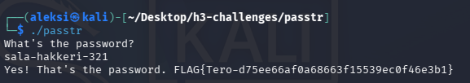
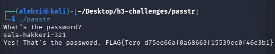
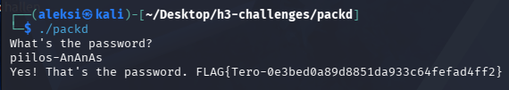

# h3 No Strings Attached

**Päivämäärä:** 6.9.2026  
**Tekijä:** Aleksi Pamilo   
**Ympäristö:** Kali Linux 2026.2 (x86_64, UTM/QEMU macOS)

> **Päivitys 7.9.2026:** Raporttia on täydennetty vertaisarvioinnista saadun palautteen perusteella. Avasin b-kohdassa tarkemmin ratkaisun syntyprosessia, tekoälyn hyödyntämistä sekä XOR-salauksen toimintalogiikkaa.
---

### a) Strings
- Asensin vaaditut riippuvuudet:
    ```bash
    sudo apt-get update && sudo apt-get install make gcc
    ```
- Kokeilin ajaa ohjelman:
    ```bash
    ./passtr
    ```
- Ohjelma kysyy salasanaa, en tiedä, kokeilen `1234` saan vastauksen: `Sorry, no bonus.`
- <details>
    <summary>Ajan komennon <code>strings ./passtr</code> (klikkaa auki nähdäksesi koko tulosteen)</summary>

    ```text  
    /lib64/ld-linux-x86-64.so.2
    puts
    __libc_start_main
    __cxa_finalize
    __isoc99_scanf
    strcmp
    libc.so.6
    GLIBC_2.7
    GLIBC_2.2.5
    GLIBC_2.34
    _ITM_deregisterTMCloneTable
    __gmon_start__
    _ITM_registerTMCloneTable
    PTE1
    u+UH
    What's the password?
    %19s
    sala-hakkeri-321
    Yes! That's the password. FLAG{Tero-d75ee66af0a68663f15539ec0f46e3b1}
    Sorry, no bonus.
    ;*3$"
    GCC: (Debian 12.2.0-14) 12.2.0
    Scrt1.o
    __abi_tag
    crtstuff.c
    deregister_tm_clones
    __do_global_dtors_aux
    completed.0
    __do_global_dtors_aux_fini_array_entry
    frame_dummy
    __frame_dummy_init_array_entry
    passtr.c
    __FRAME_END__
    _DYNAMIC
    __GNU_EH_FRAME_HDR
    _GLOBAL_OFFSET_TABLE_
    __libc_start_main@GLIBC_2.34
    _ITM_deregisterTMCloneTable
    puts@GLIBC_2.2.5
    _edata
    _fini
    __data_start
    strcmp@GLIBC_2.2.5
    __gmon_start__
    __dso_handle
    _IO_stdin_used
    _end
    __bss_start
    main
    __isoc99_scanf@GLIBC_2.7
    __TMC_END__
    _ITM_registerTMCloneTable
    __cxa_finalize@GLIBC_2.2.5
    _init
    .symtab
    .strtab
    .shstrtab
    .interp
    .note.gnu.property
    .note.gnu.build-id
    .note.ABI-tag
    .gnu.hash
    .dynsym
    .dynstr
    .gnu.version
    .gnu.version_r
    .rela.dyn
    .rela.plt
    .init
    .plt.got
    .text
    .fini
    .rodata
    .eh_frame_hdr
    .eh_frame
    .init_array
    .fini_array
    .dynamic
    .got.plt
    .data
    .bss
    .comment

    ```
    </details>

- Vastaus sisältää:
    ```text
    sala-hakkeri-321
    Yes! That's the password. FLAG{Tero-d75ee66af0a68663f15539ec0f46e3b1}
    ```
- Kokeilen vielä käynnistää ohjelman, ja syöttää tämän salasanan:

    
---

### b) Make a new version
- Alkuperäinen tiedosto sisältää salasanan ja flagin tavallisena tekstinä `nano passtr.c`:
    ```c
    // passtr - a simple static analysis warm up exercise
    // Copyright 2024 Tero Karvinen https://TeroKarvinen.com

    #include <stdio.h>
    #include <string.h>

    int main() {
        char password[20];
        
        printf("What's the password?\n");
        scanf("%19s", password);
        if (0 == strcmp(password, "sala-hakkeri-321")) {
            printf("Yes! That's the password. FLAG{Tero-d75ee66af0a68663f15539ec0f46e3b1}\n");
        } else {
            printf("Sorry, no bonus.\n");
        }
        return 0;
    }
    ```
- Korjataan tiedosto obfuskoimalla sekä salasana että flag:
    - **Ajatusprosessi ja tiedonhaku:** Koska C-kieli on minulle uutta, hain ratkaisua googlettamalla (Tutorialspoint, GeeksForGeeks). Opin XOR-salauksen olevan symmetrinen: sama toimitus (`arvo ^ avain`) sekä salaa että purkaa tiedon. Kuten GeeksForGeeks-lähteen `encryptDecrypt`-esimerkki osoittaa, täsmälleen samaa koodilogiikkaa käytetään molempiin suuntiin. Päädyin obfuskoimaan myös flagin, koska muuten sen olisi voinut edelleen lukea suoraan `strings`-komennolla, jolloin salasanan piilottamisesta ei olisi hyötyä.
    - **Toteutus:** Ymmärrän, että voisin tehdä obfuskoinnin C-koodissa manuaalisesti asettamalla jokaisen merkin erikseen (esim `char[] secret = { 's'^0x2A, 'a'^0x2A,...};`). Automatisoidakseni ja nopeuttaakseni tätä rutiinivaihetta, pyysin Gemini-tekoälyä luomaan Python-skriptit, jotka tekevät muunnokset valitsemallani avaimella (`0x2A`) valmiiksi heksataulukoiksi:
        ```bash
        python3 -c 'key=0x2A; text="sala-hakkeri-321"; print("char secret[] = {" + ", ".join(f"0x{ord(c)^key:02x}" for c in text) + ", 0x00};")'
        python3 -c 'key=0x2A; text="Yes! That'\''s the password. FLAG{Tero-d75ee66af0a68663f15539ec0f46e3b1}"; print("char flag_secret[] = {" + ", ".join(f"0x{ord(c)^key:02x}" for c in text) + ", 0x00};")'
        ```
        Saan tulokseksi:
        ```c
        char secret[] = {0x59, 0x4b, 0x46, 0x4b, 0x07, 0x42, 0x4b, 0x41, 0x41, 0x4f, 0x58, 0x43, 0x07, 0x19, 0x18, 0x1b, 0x00};
        char flag_secret[] = {0x73, 0x4f, 0x59, 0x0b, 0x0a, 0x7e, 0x42, 0x4b, 0x5e, 0x0d, 0x59, 0x0a, 0x5e, 0x42, 0x4f, 0x0a, 0x5a, 0x4b, 0x59, 0x59, 0x5d, 0x45, 0x58, 0x4e, 0x04, 0x0a, 0x6c, 0x66, 0x6b, 0x6d, 0x51, 0x7e, 0x4f, 0x58, 0x45, 0x07, 0x4e, 0x1d, 0x1f, 0x4f, 0x4f, 0x1c, 0x1c, 0x4b, 0x4c, 0x1a, 0x4b, 0x1c, 0x12, 0x1c, 0x1c, 0x19, 0x4c, 0x1b, 0x1f, 0x1f, 0x19, 0x13, 0x4f, 0x49, 0x1a, 0x4c, 0x1e, 0x1c, 0x4f, 0x19, 0x48, 0x1b, 0x57, 0x00};
        ```
        jota voin hyödyntää suoraan koodissa `nano passtr.c`:
        ```c
        // passtr - a simple static analysis warm up exercise
        // Copyright 2024 Tero Karvinen https://TeroKarvinen.com

        #include <stdio.h>
        #include <string.h>

        int main() {
            char password[20];

            char secret[] = {0x59, 0x4b, 0x46, 0x4b, 0x07, 0x42, 0x4b, 0x41, 0x41, 0x4f, 0x58, 0x43, 0x07, 0x19, 0x18, 0x1b, 0x00};
            char flag_secret[] = {0x73, 0x4f, 0x59, 0x0b, 0x0a, 0x7e, 0x42, 0x4b, 0x5e, 0x0d, 0x59, 0x0a, 0x5e, 0x42, 0x4f, 0x0a, 0x5a, 0x4b, 0x59, 0x59, 0x5d, 0x45, 0x58, 0x4e, 0x04, 0x0a, 0x6c, 0x66, 0x6b, 0x6d, 0x51, 0x7e, 0x4f, 0x58, 0x45, 0x07, 0x4e, 0x1d, 0x1f, 0x4f, 0x4f, 0x1c, 0x1c, 0x4b, 0x4c, 0x1a, 0x4b, 0x1c, 0x12, 0x1c, 0x1c, 0x19, 0x4c, 0x1b, 0x1f, 0x1f, 0x19, 0x13, 0x4f, 0x49, 0x1a, 0x4c, 0x1e, 0x1c, 0x4f, 0x19, 0x48, 0x1b, 0x57, 0x00};

            for(int i = 0; i < sizeof(secret) - 1; i++) {
                secret[i] ^= 0x2A;
            }

            printf("What's the password?\n");
            scanf("%19s", password);
            if (0 == strcmp(password, secret)) {
                for(int i = 0; i < sizeof(flag_secret) - 1; i++) {
                    flag_secret[i] ^= 0x2A;
                }
                printf("%s\n", flag_secret);
            } else {
                printf("Sorry, no bonus.\n");
            }
            return 0;
        }
        ```
- Komennolla `make` saan käännettyä uuden version.
- <details>
    <summary><code>strings ./passtr</code> ei enää näytä salasanaa eikä flagia selkokielisenä (klikkaa auki nähdäksesi koko tulosteen):</summary>

    ```text
    ^5$G
    /lib64/ld-linux-x86-64.so.2
    puts
    __isoc23_scanf
    __libc_start_main
    __cxa_finalize
    strcmp
    libc.so.6
    GLIBC_2.38
    GLIBC_2.2.5
    GLIBC_2.34
    _ITM_deregisterTMCloneTable
    __gmon_start__
    _ITM_registerTMCloneTable
    PTE1
    u+UH
    YKFK
    BKAH
    AOXC
    What's the password?
    %19s
    Sorry, no bonus.
    ~BK^
    ZKYY]EXN
    lfkmQ~OXE
    ;*3$"
    GCC: (Debian 15.2.0-17) 15.2.0
    Scrt1.o
    __abi_tag
    crtstuff.c
    deregister_tm_clones
    __do_global_dtors_aux
    completed.0
    __do_global_dtors_aux_fini_array_entry
    frame_dummy
    __frame_dummy_init_array_entry
    passtr.c
    __FRAME_END__
    _DYNAMIC
    __GNU_EH_FRAME_HDR
    _GLOBAL_OFFSET_TABLE_
    __libc_start_main@GLIBC_2.34
    _ITM_deregisterTMCloneTable
    puts@GLIBC_2.2.5
    _edata
    _fini
    __isoc23_scanf@GLIBC_2.38
    __data_start
    strcmp@GLIBC_2.2.5
    __gmon_start__
    __dso_handle
    _IO_stdin_used
    _end
    __bss_start
    main
    __TMC_END__
    _ITM_registerTMCloneTable
    __cxa_finalize@GLIBC_2.2.5
    _init
    .symtab
    .strtab
    .shstrtab
    .note.gnu.build-id
    .interp
    .gnu.hash
    .dynsym
    .dynstr
    .gnu.version
    .gnu.version_r
    .rela.dyn
    .rela.plt
    .init
    .plt.got
    .text
    .fini
    .rodata
    .eh_frame_hdr
    .eh_frame
    .note.gnu.property
    .note.ABI-tag
    .init_array
    .fini_array
    .dynamic
    .got.plt
    .data
    .bss
    .comment
    ```

    </details>

    ```text
    What's the password?
    %19s
    Sorry, no bonus.
    ```
- `./passtr` ja salasana `sala-hakkeri-321` toimivat edelleen oikein:

    

---

### c) packd
- <details>
    <summary>Ajoin komennon <code>strings ./packd</code>. Tämä palauttaa seuraavan (klikkaa auki nähdäksesi koko tulosteen):</summary>

    ```text
    strings ./packd 
    wUPX!
    Wv& 
    leg8
    ,o,Q
    /lib64
    nux-x86-
    so.2
    puts
    c_start_ma
    cxa_f   a
    c99"canf
    (rcmp
    GLIBC_2.7
    d534@ITM_deregH
    CloneTabl\gm
    }_*(
            >>H
    }E]/
    CrvP
    PTE1
    u+UH
    What's the password?
    piilos-An
    Yes! T,
    W. FLAG{Tero-0e3bed0a89d88
    51da933c64fefad
    S1ry
    , no bonus.
    ;*3$F
    NDeo2
    USQRH
    W^YH
    PROT_EXEC|PROT_WRITE failed.
    _j<X
    $Info: This file is packed with the UPX executable packer http://upx.sf.net $
    $Id: UPX 4.21 Copyright (C) 1996-2023 the UPX Team. All Rights Reserved. $
    _RPWQM)
    j"AZR^j
    PZS^
    /proc/self/exe
    IuDSWH
    s2V^
    XAVAWPH
    YT_j
    =>
    AY^_X
    D$ [I
    PX!u
    slIT$}
    t .u
    ([]A\A]
    0LK(L
    tL      G
    +xHf
    p(E1
    hW 1
    g{l
    s5Iw
    uC^I
    k1(
    p[>Z
    L6AI[u
    A^A_)&
    csmo
    m@S 
    AZ,}
    JAPC
    SRVW~
    RY?WV|YX
    GCC: (Debian 12.
    0-14)
    I@/(
    F_SYvC
    {8@j"_
    8crt1.o
    _tag
    stuff.c
    deregi
    m_clones)do_g
    o       tors9ux5omple)do
    !_fin`arr
    ay_entry
    me ummy
    _)t*
    packYcFRAME_END
    DYNIC
    GLOBAL_OFFSET_TABL
    (libc_
    \`ma
    g@&IBC_
    ITM_
    s h!dYuO
    dF_usSW
    1ic9987
    c5f[7
    .symnb
    h        Np
    .gnu.prop
    bui=.
    ld-idlI-J
    K       dynb
    ngmX
    vEsi
    la(
    .ehDhdr
    iTQdG
    dH6X
    dI||
    7dCv
    (9yr
    UPX!
    UPX!
    ```

    </details>

    ```text
    $Info: This file is packed with the UPX executable packer http://upx.sf.net $
    $Id: UPX 4.21 Copyright (C) 1996-2023 the UPX Team. All Rights Reserved. $
    ```
- Tulosteesta selviää, että sovellus on pakattu käyttäen [UPX](https://upx.github.io/).
- Komennolla `upx --help` selviää, että sovelluksen voi purkaa komennolla `upx -d ./packd`.
- <details>
    <summary>Nyt, kun ajan komennon <code>strings ./packd</code> uudelleen. Saan tämän tulosteen (klikkaa auki nähdäksesi koko tulosteen):</summary>

    ```text
    /lib64/ld-linux-x86-64.so.2
    puts
    __libc_start_main
    __cxa_finalize
    __isoc99_scanf
    strcmp
    libc.so.6
    GLIBC_2.7
    GLIBC_2.2.5
    GLIBC_2.34
    _ITM_deregisterTMCloneTable
    __gmon_start__
    _ITM_registerTMCloneTable
    PTE1
    u+UH
    What's the password?
    %19s
    piilos-AnAnAs
    Yes! That's the password. FLAG{Tero-0e3bed0a89d8851da933c64fefad4ff2}
    Sorry, no bonus.
    ;*3$"
    GCC: (Debian 12.2.0-14) 12.2.0
    Scrt1.o
    __abi_tag
    crtstuff.c
    deregister_tm_clones
    __do_global_dtors_aux
    completed.0
    __do_global_dtors_aux_fini_array_entry
    frame_dummy
    __frame_dummy_init_array_entry
    packd.c
    __FRAME_END__
    _DYNAMIC
    __GNU_EH_FRAME_HDR
    _GLOBAL_OFFSET_TABLE_
    __libc_start_main@GLIBC_2.34
    _ITM_deregisterTMCloneTable
    puts@GLIBC_2.2.5
    _edata
    _fini
    __data_start
    strcmp@GLIBC_2.2.5
    __gmon_start__
    __dso_handle
    _IO_stdin_used
    _end
    __bss_start
    main
    __isoc99_scanf@GLIBC_2.7
    __TMC_END__
    _ITM_registerTMCloneTable
    __cxa_finalize@GLIBC_2.2.5
    _init
    .symtab
    .strtab
    .shstrtab
    .interp
    .note.gnu.property
    .note.gnu.build-id
    .note.ABI-tag
    .gnu.hash
    .dynsym
    .dynstr
    .gnu.version
    .gnu.version_r
    .rela.dyn
    .rela.plt
    .init
    .plt.got
    .text
    .fini
    .rodata
    .eh_frame_hdr
    .eh_frame
    .init_array
    .fini_array
    .dynamic
    .got.plt
    .data
    .bss
    .comment
    ```

    </details>

- Tulosteesta selviää suoraan:

    ```text
    What's the password?
    %19s
    piilos-AnAnAs
    Yes! That's the password. FLAG{Tero-0e3bed0a89d8851da933c64fefad4ff2}
    ```
        
    

---

### Lähteet
1. Kurssitehtävä: [Tero Karvinen: Application Hacking - h3 No Strings Attached](https://terokarvinen.com/application-hacking/#homework-tasks). Luettu: 6.9.2026.
2. tutorialspoint: Bitwise operators in C. URL: https://www.tutorialspoint.com/cprogramming/c_bitwise_operators.htm Luettu: 6.9.2026
3. GeeksForGeeks: XOR Cipher. URL: https://www.geeksforgeeks.org/dsa/xor-cipher/ Luettu: 6.9.2026
4. Google Gemini -kielimallia käytettiin apuna salauslogiikan ymmärtämisessä, C-koodin syntaksin hiomisessa (esim. `sizeof`-operaattorin käyttö) sekä salattujen merkkitaulukoiden generoimiseen tarvittavien Python-komentojen luomisessa.