# h3 Some Disassembly Required

**Päivämäärä:** 12.9.2026  
**Tekijä:** Aleksi Pamilo   
**Ympäristö:** Kali Linux 2026.2 (x86_64, UTM/QEMU macOS)

---

### Hammond 2022 Ghidra for Reverse Engineering (PicoCTF 2022 #42 'bbbloat')
- Aluksi ohjelman toimintaa yritetään selvittää dynaamisesti kevyemmillä komentorivityökaluilla `strace` ja `ltrace`, mutta ne eivät paljasta ratkaisua.
- Tämän vuoksi haasteen ratkaisemisessa otetaan avuksi ohjelmiston purkuun tarkoitettu Ghidra.
- Analysoimalla ohjelman koodia Ghidrassa selviää, että ohjelma odottaa käyttäjältä salasanaa, joka on koodiin upotettu heksadesimaaliluku 0x86187.
- Kun tämä luku muunnetaan desimaalimuotoon, saadaan luku 549255 ja kun tämä syötetään ohjelmaan, ohjelma tulostaa lipun (kuvakaappaus videosta): 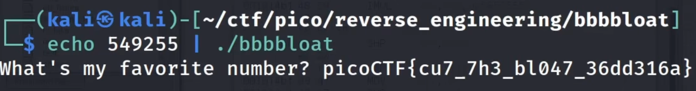

---

### rever-C
- Asensin Ghidran komennolla `sudo apt-get install ghidra`
- Avasin Ghidran ja loin uuden projektin `ezbin-challenges`
    - Toin `packd` tiedoston: `I` -> Valitsin `packd` -tiedoston `ezbin-challenges` -hakemistosta.
    - Ghidra kertoo kyseessä olevan `ELF` tyyppinen tiedosto, importoin sen painamalla OK.
    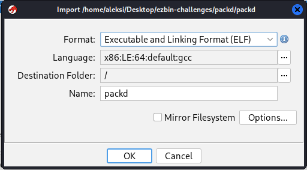
    - Seuraavaksi valitsen `packd` tiedoston listasta ja klikkaan lohikäärme-ikonia.
    - Jostain syystä ohjelma ei näytä mitään, tämä sama tapahtui tunnilla, joten tiedän kokeilla importoida tiedoston uudelleen: `file -> Import File -> packd`, sovellus sanoo, että tiedosto on jo olemassa, joten annan sille nimen `packd1`.
    - Nyt ohjelma antaa analysoida sovelluksen:
    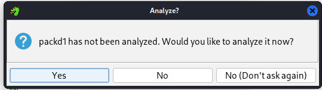
    - Hetken aikaa tutkin ja päädyin lukemaan ohjeista lisätukea; yksi hyvin oleellinen asia unohtui: sovelluksen purkaminen ensin. Ajoin komennon `upx -d packd -o unpackd`.
    - Importoin Ghidra sovelluksessa nyt `unpackd` tiedoston, ja Ghidra tarjoaa analysointia automaattisesti, klikkaan OK.
    - Hammond 2022 Ghidra for Reverse Engineering videosta opittu Defined Strings näkymä paljastaa suoraan salasanan sekä löydämme koodin:
    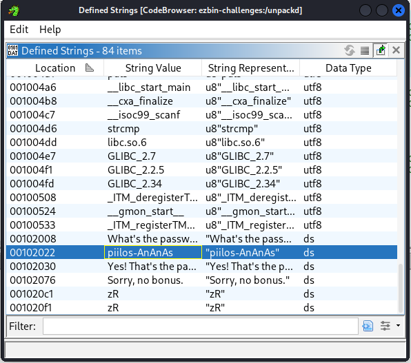
    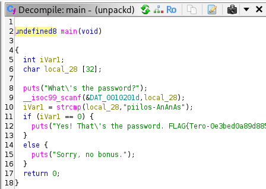
- Miten ohjelma toimii?
    - Ohjelma aloittaa tulostamalla `"What's the password"`
    - Seuraavaksi ohjelma pyytää käyttäjältä syötteen `scanf` ja tallentaa sen muuttujaan `local_28` (uudelleennimesin tämän `userInput`).
    - Ohjelma vertailee käyttäjän syötettä `userInput` ja tekstiä `"piilos-AnAnAs"` ja tallentaa vastauksen muuttujaan `iVarl` (uudelleennimesin tämän `isMatch`).
        - `strcmp` palauttaa 0, jos tekstit (`userInput` ja `"piilos-AnAnAs"`) ovat sama. (cppreference)
    - Jos `isMatch` on 0, sovellus tulostaa onnistumisviestin: `Yes! That's the password. FLAG{Tero-0e3bed0a89d8851da933c64fefad4ff2}`
    - Jos `isMatch` on jotain muuta kuin 0, sovellus tulostaa epäonnistumisviestin: `Sorry, no bonus.`.
    - Ohjelma lopettaa ajamisen palauttamalla `0`.

---

### passtr
- Importoin sovelluksen `passtr`.
- Ghidra tarjoaa analysointia automaattisesti, joten klikkaan vain OK.
- `Functions` valikosta löytyy suoraan `main` funktio, klikkaan sen auki.
- `passtr` sisältää samat muuttujat `iVarl` ja `local_28`, joten nimeän ne taas `isMatch` ja `userInput`.
- Kun klikkaan Decompile ikkunassa `if (isMatch == 0) {` riviä, Listing ikkunassa siirryn kohtaan `001011a3 75 11           JNZ        LAB_001011b6`
    - `JNZ` = not equal / not zero, `JZ` = equal / zero. (stackoverflow)
    - Hiiren oikealla klikkaamalla voin valita `Patch Instruction`, jonka jälkeen voin vaihtaa `JNZ` komennon `JZ`.
- Exportoin tiedoston `File -> Export Program -> Original File`
- Yritin ajaa ohjelman, mutta sain virheen, että oikeuksia ei ole. Kokeilin ajaa ohjelman myös `sudo ./passtr`, mutta tämäkään ei toiminut.
- Annoin sovellukselle execute oikeudet komennolla `chmod +x ./passtr`.
- Nyt ohjelma hyväksyy kaikki salasanat, paitsi oikeaa salasanaa.
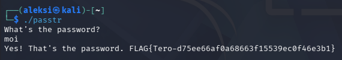
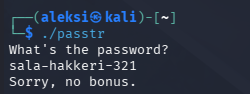

---

### Nora crackme01
- Aloitin asentamalla riippuvuudet: `sudo apt install build-essential gcc xxd binutils`.
- Kloonasin GitHub repositorion joka sisältää kaikki crackme -tehtävät. `git clone https://github.com/NoraCodes/crackmes.git`
- Ajoin komennon `make crackme01`, ja sain virheen `cannot find -lcrypt` -virheen.
- Googlettamalla `/usr/bin/x86_64-linux-gnu-ld.bfd: cannot find -lcrypt` ei löytynyt nopeasti mitään, joten turvauduin Google Gemini puoleen, ja sain vastauksen: `sudo apt install libcrypt-dev`.
- Nyt sain ajettua komennon `make crackme01`.
- Importoin kyseisen tiedoston Ghidraan.
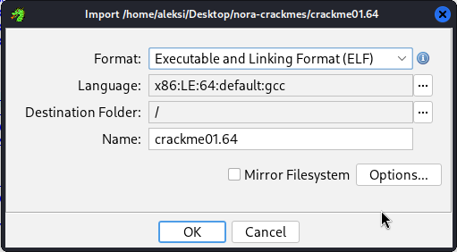
- Tämä tehtävä oli todella helppo, ja se vastaus löytyy suoraan riviltä 11: `password1`.
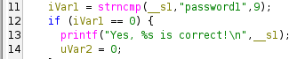
- Kun ajan ohjelman, ja syötän tämän `password1` parametriksi, saan vastauksen:
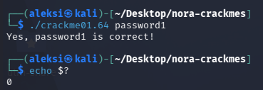

---

### Nora crackme01e
- Aloitin taas ajamalla komennon `make crackme01e`.
- Importoin `crackme01e.64` Ghidraan.
- `Functions` kohdasta löytyy `main`-funktio.
- Kokeilin vielä ajaa `./crackme01e.64` sovelluksen, sovellus palauttaa `Need exactly one argument.`
- Salasana on taas suoraan näkyvissä rivillä 11: `slm!paas.k`
- Yritin syöttää salasana, mutta ZSH-komentotulkki antoi virheen `event not found: paas.k`.
- Sain ohjelman hyväksymään syötteen ohittamalla huutomerkin kenoviivalla.
    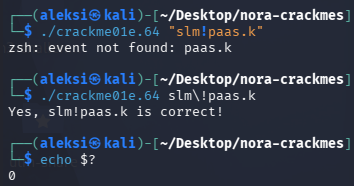

---

### Nora crackme02
- Aloitin ajamalla komennon `make crackme02`.
- Importoin `crackme02.64` Ghidraan.
- Muuttujien uudelleennimeäminen: (klikkaa avataksesi)
    - `param_1` -> `argc`
    - `param_2` -> `argv`
    - `pcVar1` -> `userInput`
    - `pcVar5`-> `targetWord`
    - `cVar2` -> `targetChar`
    - `pcVar4` -> `inputIterator`
    - `uVar3` -> `exitCode`
- Ohjelma aloittaa määrittelemällä muuttujat `currentChar`, `exitCode`, `inputIterator`, `baseString`, `userInput`, mutta ei alusta niitä.
- Seuraavaksi ohjelma tarkistaa, että argumenttien määrä on 2 `./crackme02 argumentti`.
- Seuraavaksi ohjelma asettaa seuraavat muuttujat:
    - `userInput` = käyttäjän syöttämä merkkijono.
    - `baseString` = `"password1"`
    - `currentChar` = `'p'`
    - `inputIterator` = `userInput`
- Seuraavaksi ohjelma siirtyy silmukkaan:
    - Ensimmäisellä kierroksella ohjelma asettaa `baseString = baseString + 1`
    - Jos inputIterator on `\0`, silmukka pysäytetään tähän.
    - Seuraavaksi ohjelma tarkistaa, mikäli `currentChar + -1` ei ole yhtä suuri kuin käyttäjän syöttämä nykyinen kirjain `*inputIterator`. Jos ne eivät täsmää, ohjelma tulostaa virheilmoituksen ja suoritus päättyy `return 1`.
    - Jos kirjaimet täsmäävät, ohjelma hakee `currentChar`-muuttujaan seuraavan kohdekirjaimen, siirtää syötteen osoitinta yhdellä eteenpäin ja jatkaa silmukkaa, kunnes vastaan tulee sanan loppumerkki `\0`.
- Dry run
    - Alkutietona meillä on:  
    Kohdesana: `password1`  
    Laskutoimitus: Siirrä ASCII-arvoa yhdellä taaksepäin   

    **Kierros 1:**
    - `currentChar` on 'p'
    - Laskutoimitus: `'p' - 1 = 'o'`
    - Päätelmä: Käyttäjän syöttämän salasanan 1. kirjain täytyy olla 'o'.
    - Haetaan kohdesanan seuraava kirjain: 'a'.

    **Kierros 2:**
    - `currentChar` on 'a'
    - Laskutoimitus: <code>'a' - 1 = '`'</code>
    - Päätelmä: Käyttäjän syöttämän salasanan 2. kirjain täytyy olla '`'.
    - Haetaan kohdesanan seuraava kirjain: 's'.

    **Kierros 3:**
    - `currentChar` on 's'
    - Laskutoimitus: `'s' - 1 = 'r'`
    - Päätelmä: Käyttäjän syöttämän salasanan 3. kirjain täytyy olla 'r'.

- Kun otamme jokaisesta merkistä ASCII taulukossa yhden aikaisemman merkin, saamme selvitettyä tehtävän:
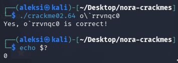

---

### Lähteet
1. Kurssitehtävä: [Tero Karvinen: Application Hacking - h4 Some Disassembly Required](https://terokarvinen.com/application-hacking/#homework-tasks). Luettu: 12.9.2026.
2. Hammond 2022. Ghidra for Reverse Engineering (PicoCTF 2022 #42 'bbbloat'). URL: https://www.youtube.com/watch?v=oTD_ki86c9I Katsottu: 12.9.2026
3. cppreference. strcmp. URL: https://en.cppreference.com/c/string/byte/strcmp Luettu: 12.9.2026
4. Stack Overflow. JNZ & CMP Assembly Instructions. URL: https://stackoverflow.com/questions/14841169/jnz-cmp-assembly-instructions Luettu: 12.9.2026
5. NoraCodes. An Intro to x86_64 Reverse Engineering. URL: https://nora.codes/tutorial/an-intro-to-x86_64-reverse-engineering/ Luettu: 12.9.2026
6. ASCII-code.com. ASCII printable characters URL: https://www.ascii-code.com/ Luettu: 12.9.2026
7. 