# h5 Binääri tässä, missä koodit?

**Päivämäärä:** 18.9.2026  
**Tekijä:** Aleksi Pamilo   
**Ympäristöt:**
- Kali Linux 2026.2 (x86_64, UTM/QEMU macOS)
- Kali Linux 2026.2 (x86_64, VirtualBox), Ryzen 7 9800x3d, Nvidia RTX 5070 TI
- Kali Linux 2026.2 (x86_64), Intel i3-1115G4

---

### lab0
- Aloitin asentamalla tiedostot hakemistoon `~/Desktop/challenges/Dynaaminen analyysi` ja purkamalla ne `unzip '*.zip'` -komennolla.
- Siirryin lab0 kansioon `cd lab0` ja avasin gdb näkymän `gdb ./buggy_program`.
- Komennolla `list` nähdään koodi.  
    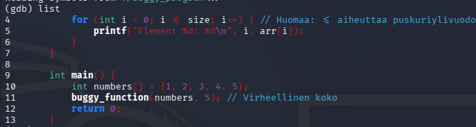
- Lisään breakpointin riville 4 `b 4`, ja `r` -komennolla käynnistän sovelluksen.
- `watch i` ja `watch size` komennoilla saan selville jokaisella kierroksella, mitä nämä muuttujat pitää sisällään.
- `continue` komentoa käyttämällä näen jokaisen kierroksen
    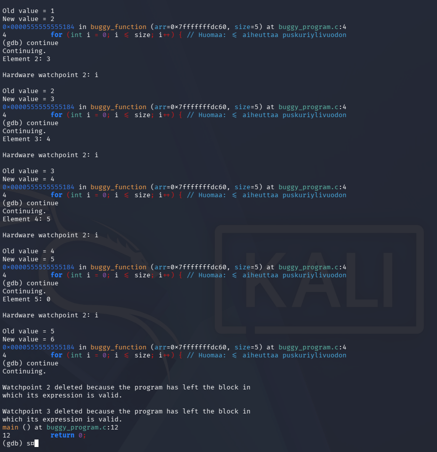
- Tästä nähdään, että viimeisellä kierroksella `New value = 6`. Eli `<=` aiheuttaa sen, että ohjelma pyörii yhden kerran liikaa.
- Nyt voin korjata koodin vaihtamalla pienempi tai yhtä suuri kuin merkin pienempi kuin merkiksi.
- `nano ./buggy_program.c`
    ```c
    // Rikkinäinen funktio
    void buggy_function(int *arr, int size) {
        for (int i = 0; i <= size; i++) { // Huomaa: <= aiheuttaa puskuriylivuodon
            printf("Element %d: %d\n", i, arr[i]);
        }
    }

    // Korjattu funktio, kun <= -merkki vaihdetaan < -merkiksi
    void buggy_function(int *arr, int size) {
        for (int i = 0; i < size; i++) {
            printf("Element %d: %d\n", i, arr[i]);
        }
    }
    ```
- `make` -komennolla saan käännettyä sovelluksen uudelleen.
-  Nyt ohjelma pysähtyy viidenteen numeroon.
    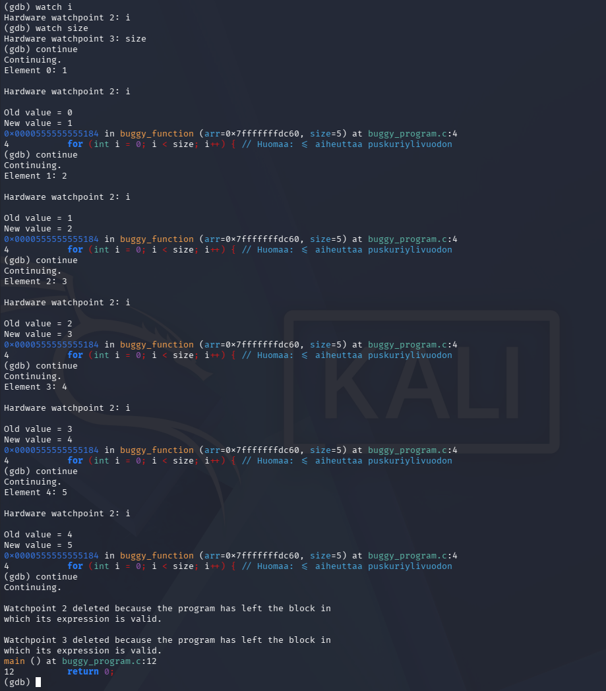

- Ennen ja jälkeen:  
    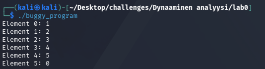  
    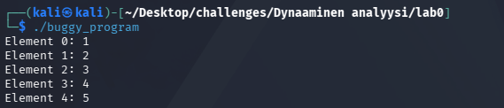

---

### lab1
- Siirryin edellisestä tehtävästä lab1 tehtävään komennolla `cd ../lab1`.
- Avaan gdb näkymän komennolla `gdb ./gdb_example1`.
- Ajan ohjelman komennolla `r`. Gdb kertoo suoraan, että ohjelma kaatuu `Segmentation fault` virheeseen, ja että tämä tapahtuu rivillä 7.  
    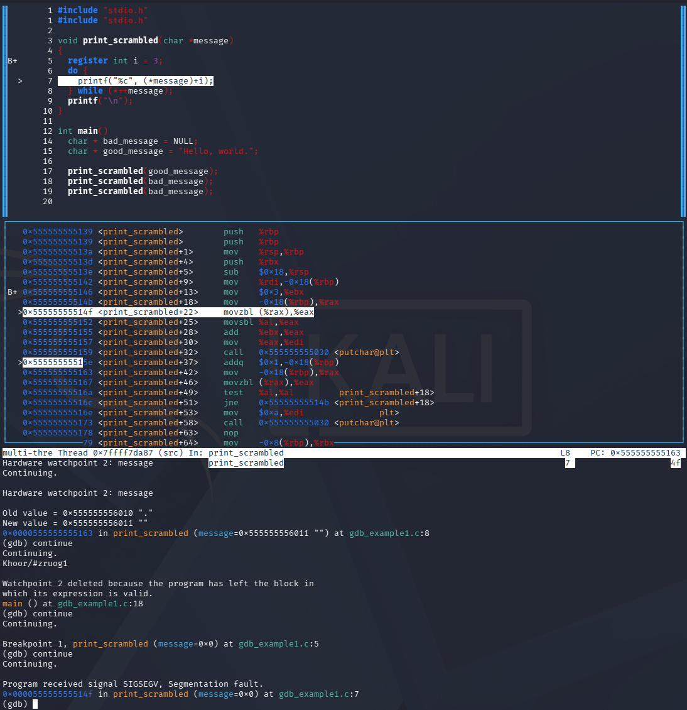
- Ohjelman voi korjata ohittamalla `NULL` viestit.
    ```c
    #include "stdio.h"

    void print_scrambled(char *message)
    {
        // Lisätään koodiin if-lause, joka tarkistaa, että onko message NULL, jos on, tämä viesti ohitetaan.
        if (message == NULL) {
            return;
        }

        register int i = 3; 
        do {
            printf("%c", (*message)+i);
        } while (*++message);
        printf("\n");
    }

    int main()
    {
        char * bad_message = NULL;
        char * good_message = "Hello, world.";

        print_scrambled(good_message);
        print_scrambled(bad_message);
    }
    ```
- Nyt ohjelma voidaan suorittaa onnistuneesti.  
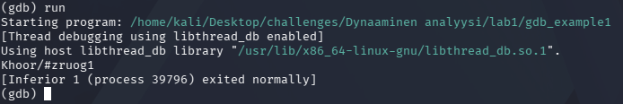

---

### lab2
- Siirryn tehtäväkansioon komennolla `cd ~/Desktop/challenges/Dynaaminen\ analyysi/lab2/passtr`.
- Kansiossa on kaksi binääriä, `passtr` ja `passtr2o`. Tehtävänä on murtaa `passtr2o`, jonka lähdekoodia ei ole, joten avaan sen GDB:hen komennolla `gdb ./passtr2o`.
- `info functions` komennolla löytyy kaikki ohjelman funktiot ja symbolit.
- `disas main` -komennolla saan purettua main funktion.
- Tämä ei vielä kerro hirveästi, kokeillaan purkaa funktio `mAsdf3a`, ja asetetaan breakpoint funktion alkuun `b *mAsdf3a`.
- Tästä näkyy `mov %rdi,%rbp` ja `mov %rsi,%rbx`. Käynnistän ohjelman `r`, ja syötän salasanaksi `testi`.
- Ohjelma pysähtyy breakpointtiin, printataan `rsi` ja `rdi` muuntamalla ne ensin char muotoon `print (char*) $rsi`, `print (char*) $rdi`.
- Tämä paljastaa, että `$rsi` on käyttäjän syöte, ja `$rdi` on oletettavasti salasana.  
    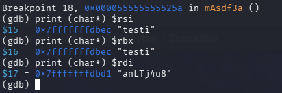
- `anLTj4u8` ei kuitenkaan ole ohjelman hyväksymä salasana, joten sille todennäköisesti tehdään jotain, tai se ei ole etsimämme salasana.

> **Tekoälyn käyttö:** Jäin jumiin funktion `mAsdf3a` assemblyn tulkinnassa ja käytin tästä eteenpäin apuna tekoälyä (Claude). Tekoäly selitti käskyjen merkityksen (silmukka, parillisuustarkistus `test $0x1,%al` sekä `add $0x3` / `sub $0x7` -muunnokset) ja ehdotti GDB:n `commands`-ominaisuutta odotettujen merkkien tulostamiseen. Ajoin komennot, otin kuvakaappaukset ja varmistin salasanan ja lipun itse.

- Puretaan funktio `disas mAsdf3a`.
    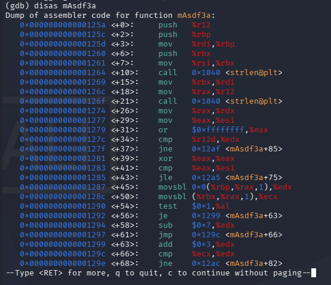
- Funktio toimii näin:
    - `call strlen` kahdesti ja `cmp %r12d,%edx`: salasanan ja tallennetun merkkijonon pituuden pitää olla sama, eli 8 merkkiä.
    - Silmukassa luetaan tallennettu merkki `edx`:ään ja syötteen merkki `ecx`:ään.
    - `test $0x1,%al` tarkistaa, onko indeksi pariton. Parillisessa indeksissä tallennettuun merkkiin lisätään 3 (`add $0x3,%edx`), parittomassa vähennetään 7 (`sub $0x7,%edx`).
    - `cmp %ecx,%edx` vertaa muunnettua merkkiä syötteeseen. Jos ne eroavat, funktio palauttaa -1.
- Salasana on siis `anLTj4u8`, jonka merkkejä on muunnettu. Muunnetut merkit saa selville GDB:llä pysäyttämällä ohjelman vertailukohtaan `mAsdf3a+66`.
- Asetan breakpointin ja liitän siihen komennot, jotka tulostavat odotetun merkin ja kopioivat sen syötteen merkin tilalle. Näin silmukka ei katkea ensimmäiseen väärään merkkiin:
    ```
    b *mAsdf3a+66
    commands
    silent
    p/c $edx
    set $ecx = $edx
    c
    end
    ```
- Käynnistän ohjelman `r` ja syötän minkä tahansa 8-merkkisen salasanan, esim. `aaaaaaaa`.
- GDB tulostaa jokaisella kierroksella odotetun merkin:
    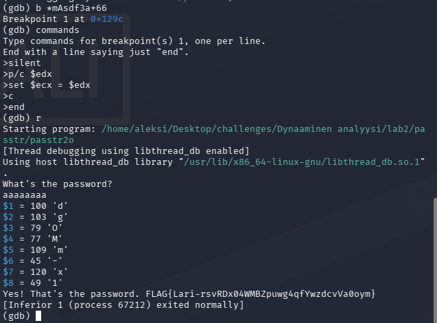
- Merkit yhdistämällä salasanaksi saadaan `dgOMm-x1`.
- Ajetaan ohjelma ilman debuggeria `./passtr2o` ja syötetään salasana. Ohjelma tulostaa lipun `FLAG{Lari-rsvRDx04WMBZpuwg4qfYwzdcvVa0oym}`.
    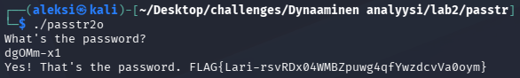

### Mitä uutta opin GDB:stä
- `info functions`: ohjelman funktioiden listaus, kun lähdekoodia ei ole.
- `disas`: funktion purkaminen assemblyksi.
- `b *funktio+offset`: breakpoint tiettyyn käskyyn eikä rivinumeroon.
- `print (char*) $rdi`: rekisterin tulkitseminen merkkijonona. x86-64:ssä funktion argumentit kulkevat järjestyksessä `rdi`, `rsi`, `rdx`...
- `p/c $edx`: rekisterin arvo merkkinä.
- `set $rekisteri = arvo`: rekisterin muuttaminen kesken ajon.
- `commands ... end`: komennot, jotka ajetaan automaattisesti breakpointissa.

---

### lab3
- Valitsin tehtäväksi `crackme01.64`. Kansion `lab3/crackmes` README:n mukaan tavoitteena on saada ohjelma päättymään paluuarvoon 0. Lähdekoodia (`crackme01.c`) en lukenut.
- Siirryn kansioon komennolla `cd ~/Desktop/challenges/Dynaaminen\ analyysi/lab3/crackmes`.
- `strings` ei ollut asennettuna. Se kuuluu `binutils`-pakettiin, joten asensin sen komennolla `sudo apt install binutils`.
- `strings crackme01.64` -komento listaa binäärin tulostettavat merkkijonot. Niiden joukosta löytyy `password1`, joka on todennäköinen salasana.
- Varmistan GDB:llä, että ohjelma todella vertaa syötettä tähän merkkijonoon. Avaan ohjelman komennolla `gdb ./crackme01.64`.
- `disas main` -komennolla näen, että ohjelma kutsuu `strncmp`-funktiota kohdassa `main+30`.
- Asetan breakpointin kutsuun `b *main+30` ja käynnistän ohjelman argumentilla `a` komennolla `r a`.
- Ohjelman pysähdyttyä tulostan `strncmp`:n kaksi ensimmäistä argumenttia komennoilla `print (char*) $rdi` ja `print (char*) $rsi`. `$rdi` sisältää syötteeni `a` ja `$rsi` merkkijonon `password1`, joten ohjelma vertaa syötettä juuri siihen.
    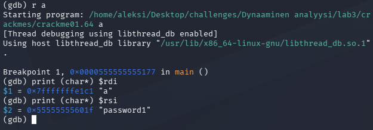
- Ajan ohjelman ilman debuggeria oikealla salasanalla ja tulostan paluuarvon: `./crackme01.64 password1; echo $?`.
- Ohjelma tulostaa `Yes, password1 is correct!` ja paluuarvo on `0`, joten salasana on `password1`.
    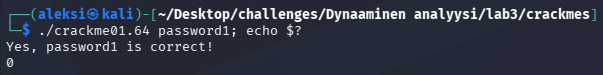

---

### Lähteet
1. Kurssitehtävä: [Tero Karvinen: Application Hacking - h5 Binääri tässä, missä koodit?](https://terokarvinen.com/application-hacking/#homework-tasks). Luettu: 18.9.2026.
2. Claude (Anthropic): käytetty funktion `mAsdf3a` assemblyn selittämiseen lab2-tehtävässä. Käytetty: 23.9.2026.
