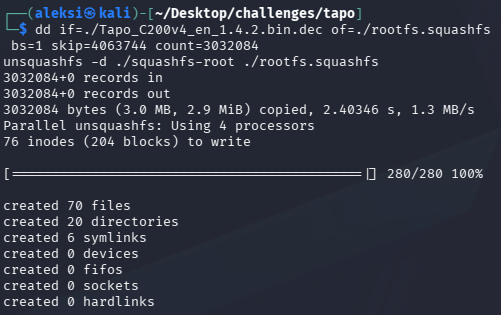
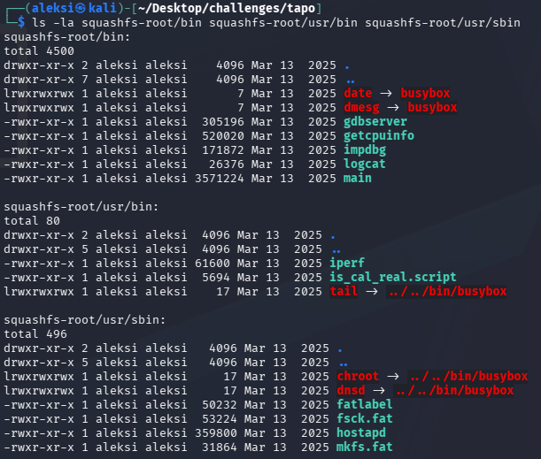

# h6 Onkohan tämä turvallinen käyttää?

**Päivämäärä:** 29.9.2026  
**Tekijä:** Aleksi Pamilo   
**Ympäristöt:** Kali Linux 2026.2 (x86_64), Intel i3-1115G4

---

### Esivalmistelut
- Asensin `tp-link-decrypt` työkalun ohjeistuksen mukaan: `git clone https://github.com/robbins/tp-link-decrypt`.
- Latasin firmwaren: `aws s3 cp s3://download.tplinkcloud.com/firmware/Tapo_C200v3_en_1.4.2_Build_250313_Rel.40499n_up_boot-signed_1747894968535.bin Tapo_C200v4_en_1.4.2.bin --no-sign-request`.
    - aws ei ollut valmiiksi asennettuna, joten asensin sen `sudo apt update && sudo apt install -y awscli`.
- Siirryin kansioon `tp-link-decrypt` ja ajoin komennon `./preinstall.sh`.
- Seuraavaksi ajoin komennon `./extract_keys.sh`.
    - Tämä epäonnistui virheesen `xxd not found`.
    - Asensin `xxd` komennolla `sudo apt install -y xxd`.
    - Nyt tulee virheet: `'jefferson' ... might not be installed correctly` ja `'ubireader_extract_files' ... might not be installed correctly`.
        - Asensin ne:
            ```bash
            sudo apt install -y python3-pip python3-venv pipx
            pipx ensurepath
            source ~/.bashrc
            pipx install ubi_reader
            pipx install jefferson
            pipx inject jefferson python-lzo
            ```
    - Lisää virheitä: `fatal error: lzo/lzo1.h: No such file or directory`
        - `sudo apt install -y liblzo2-dev build-essential python3-dev`
        - Yritin epäonnistunutta latausta uudelleen: `pipx inject jefferson python-lzo`
        - Onnistui!

---

### Laiteohjelmiston purkaminen
- Nyt kokeilen uudelleen `./extract_keys.sh`
- Ajan komennon `make`
- Sitten decryptoidaan firmware: `./bin/tp-link-decrypt ../Tapo_C200v4_en_1.4.2.bin`
    ```
    TP-link firmware decrypt

    Watchful_IP & robbins 03-10-25 v0.0.4
    watchfulip.github.io

    Tapo firmware header found
    RSA-2048

    key/iv:
    KEY=9c6ba1d761e4eee17dfde90cfed603bd
    IV=8778f31423815ce85e9f186b60507edd

    Firmware verification successful

    Decrypted firmware written to ../Tapo_C200v4_en_1.4.2.bin.dec
    ```
- Ajoin puretulle tiedostolle `binwalk`: `binwalk Tapo_C200v4_en_1.4.2.bin.dec`.
- Olennaiset löydökset:
    ```
        132096 0x20400 uImage header, OS: Linux, CPU: MIPS, compression: lzma, image name: "mips Ingenic Linux-3.10.14"
        4063744 0x3E0200 Squashfs filesystem, little endian, version 4.0, compression:xz, size: 3032084 bytes, 96 inodes
    ```

---

### Juuritiedostojärjestelmän purkaminen
- Binwalk paljasti SquashFS-tiedostojärestelmän offsetissa `0x3E0200` ja koon `3032084` tavua. Leikkasin osion irti `dd`:llä ja purin sen `unsquashfs`:llä.
 

---

### Sovellusten etsintä
- Tutkin puretun `bin`-hakemiston sisältöä: `ls -la squashfs-root/bin`  


    | Tiedosto                         | Kuvaus                           |
    | -------------------------------- | -------------------------------- |
    | `main`                           | Laitteen pääsovellus             |
    | `gdbserver`                      | Etädebuggaustyökalu              |
    | `impdbg`, `getcpuinfo`, `logcat` | Debug- ja diagnostiikkatyökaluja |
    | `hostapd`                        | WiFi-tukiasemaohjelmisto         |
    | `iperf`                          | Verkon suorituskyvyn mittaus     |
- Huomionarvoista on debug työkalut tuotanto-ohjelmistossa.

---

### Root-salasanan etsintä
- Etsin käyttäjätilit puretusta imagesta:
    ```bash
    cat squashfs-root/etc/passwd
    cat squashfs-root/etc/shadow
    ```
- Kumpaakaan tiedostoa ei löytynyt tästä `rootfs`-osiosta.
- Etsin salasanatiedostoja laajemmin: `find . -name "shadow" -o -name "passwd"
- `find` löysi passwd/shadow-tiedostoja vain `tmp.fwextract`-kansiosta, eli muista firmwareista, joita `extract_keys.sh` latasi avainten poimintaa varten. Kohteeni C200:n omasta rootfs:stä niitä ei löytynyt.
- Tutkin vertailun vuoksi C210:n tiedostot:
    - shadow: root-rivillä `x`, ei hashia.
    - passwd: root-rivillä MD5crypt-hash ($1$):
    `root:$1$25eSKZzk$8tcPTWPrTHbnFhV47CX9P.:0:0:root:/root:/bin/ash`
    - Tunnistin hash tyypin ja yritin avata sen john the ripperillä: `john --format=md5crypt --wordlist=/usr/share/wordlists/rockyou.txt c210_hash.txt`
    - Loaded 1 password hash (md5crypt, crypt(3) $1$ (and variants) [MD5 512/512 AVX512BW 16x3])
- Ajoin john the ripperin loppuun rockyou-sanalistalla.
    `0 password hashes cracked, 1 left`
- Salasana ei auennut: MD5crypt-hash on periaatteessa murrettavissa, mutta root-salasana ei kuulunut yleisimpien joukkoon.
- Huom: tämä hash on C210-mallista, ei kohteeni C200:sta. C200:n omasta rootfs:stä ei löytynyt salasanatiedostoja.

---

### Tapo C200 -kameran ohjelmiston turvallisuus
- **Vanha kernel**: Laite käyttää linux 3.10.14 -kerneliä, joka on julkaistu 2010-luvun alussa ja jonka virallinen tuki on päättynyt vuosia sitten. Vanhentunut kernel voi sisältää korjaamattomia haavoittuvuuksia.
- **Debug-työkalut tuotannossa**: rootfs:n bin-hakemistosta löytyi gdbserver sekä impdbg, getcpuinfo, ja logcat. Tuotantolaitteeseen jätetty debug-toiminnallisuus on `CWE-489` -luokituksen mukainen heikkous.
- **Root-salasana**: Kohteeni C200:n firmwaresta ei löytynyt lainkaan passwd/shadow-tiedostoja. Vertailukohtana tutkitussa C210:ssa root-salasana oli MD5crypt-hash, joka ei kuitenkaan auennut sanalistahyökkäyksellä.
- **Johtopäätös**: Staattinen analyysi paljasti hyökkäyspintaa, mutta suoraan hyödynnettävää haavoittuvuutta en voinut todentaa ilman fyysistä laitetta ja dynaamista testausta. Löydökset ovat teoreettisia riskejä, jotak edellyttäisivät lisätutkimusta varmistuakseen.

---

### Lähteet
1. Kurssitehtävä: [Tero Karvinen: Application Hacking - h6 Onkohan tämä turvallinen käyttää?](https://terokarvinen.com/application-hacking/#homework-tasks). Luettu: 29.9.2026
2. CWE-489: Active Debug Code. URL: https://cwe.mitre.org/data/definitions/489.html Luettu: 29.9.2026